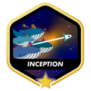

<!--
**Leofariasrj25/leofariasrj25** is a ✨ _special_ ✨ repository because its `README.md` (this file) appears on your GitHub profile.

Here are some ideas to get you started:

- 🔭 I’m currently working on ...
- 🌱 I’m currently learning ...
- 👯 I’m looking to collaborate on ...
- 🤔 I’m looking for help with ...
- 💬 Ask me about ...
- 📫 How to reach me
- 😄 Pronouns: ...
- ⚡ Fun fact: ...
-->

# Hello there, I'm Leonardo.

  

 

### Born to code, human after all!

- 🧑‍💻 Software Developer.
- 👨‍🎓 studying software engineering at <a title="Coding School" href="https://www.42network.org/">École 42<a> <a href="https://42.rio/">(Rio Campus)</a>. 
- 📖 Currently learning: IA and Cybersecurity.
- 📖 Currently reading: The Pragmatic Programmer.    
- 💻 Passionate about tech and the future.
- 🥅 2025 Goals: Learn more about robotics 🤖.
- ⚡ Fun fact: I love cars and motorsports.

---

### Where to find me:

   
   
  

---

### Languages and Tools:

---

### 42 journey

---

### 📕 Latest Blog Posts

<!-- BLOG-POST-LIST:START -->
- [Push_Swap — Um projeto sobre pilhas e ordenação.](https://leofariasrj25.medium.com/push-swap-um-projeto-sobre-pilhas-e-ordena%C3%A7%C3%A3o-5aecdbe33903?source=rss-a9f5ec3b3b67------2)
- [Roadmap dos Projetos level 2 – escola 42](https://leofariasrj25.medium.com/roadmap-dos-projetos-level-2-escola-42-66904df0a837?source=rss-a9f5ec3b3b67------2)
- [Minha Incrível Jornada no Basecamp 1 da 42|Rio](https://leofariasrj25.medium.com/minha-incr%C3%ADvel-jornada-no-basecamp-1-da-42-rio-6c02af098321?source=rss-a9f5ec3b3b67------2)
- [Usando o anki para ter uma memória quase fotográfica!](https://leofariasrj25.medium.com/usando-o-anki-para-ter-uma-memoria-quase-fotogr%C3%A1fica-23223273c87a?source=rss-a9f5ec3b3b67------2)
- [Oi! Bora construir a nossa própria piscina com tobogãs e golfinhos?](https://leofariasrj25.medium.com/oi-bora-construir-a-nossa-pr%C3%B3pria-piscina-com-tobog%C3%A3s-e-golfinhos-8fac671cee39?source=rss-a9f5ec3b3b67------2)
<!-- BLOG-POST-LIST:END -->

➡️ [more blog posts...](https://leofariasrj25.medium.com)

---

